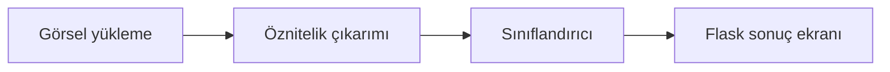

<div align="center">

# Flower Classifier

**Transfer learning ile çiçek sınıflandırma**


[](LICENSE)

Görselleri MobileNetV2 özellikleri ve SVM sınıflandırıcısıyla analiz eden Flask tabanlı çiçek sınıflandırma uygulaması.

</div>

---

## Öne Çıkanlar

- TensorFlow Flowers üzerinde beş sınıflı analiz
- Çiçek olmayan örneklerle geliştirilmiş sınıflandırma
- Görsel yükleme, önizleme ve güven kontrolleri

## Teknolojiler

Python · Flask · MobileNetV2 · SVM

## Teknik yaklaşım

MobileNetV2 bottleneck özellikleri ve klasik RGB/HSV, LBP ve GLCM çıkarım fonksiyonları depoda yer alır. Flask uygulaması yüklenen görseli sınıflandırma akışına taşır.



## Kodu incelemeye başlayın

- [app.py](app.py)
- [feature_extraction.py](feature_extraction.py)
- [templates/index.html](templates/index.html)
- [validate_setup.py](validate_setup.py)

## Kapsam ve sınırlar

Sonuçlar eğitim dağılımına bağlıdır. Güven eşiği, çiçek olmayan tüm görselleri güvenilir şekilde reddetme garantisi değildir.

<details>
<summary><strong>Kurulum, kullanım ve teknik ayrıntılar</strong></summary>

Bu repoda, başlangıçta klasik **renk ve doku tabanlı öznitelikler** kullanılarak geliştirilen bir çiçek sınıflandırma projesi yer almaktadır. Proje daha sonra **Transfer Learning (MobileNetV2)** tabanlı bir pipeline ve **SVM sınıflandırıcısı** ile güçlendirilmiş; ayrıca **Flask uygulaması** tarafında kararlılık ve kullanıcı deneyimini artırmaya yönelik çeşitli iyileştirmeler yapılmıştır.

Bu README aşağıdaki bölümleri içermektedir:
- Projenin kısa özeti  
- Yapılan önemli değişikliklerin özeti  
- Uygulamanın düzgün çalışması için korunmuş dosyalar  
- `archive/` dizinine taşınan dosyaların listesi  

---

## Kısa Öz

- **Veri seti:** `flower_photos/` (TensorFlow Flowers veri seti, 5 sınıf)  
- **Ana model:** MobileNetV2 üzerinden çıkarılan bottleneck özellikleri + SVM  
  (negatif/çiçek olmayan örneklerle iyileştirilmiştir)  
- **Web arayüzü:** Flask tabanlı uygulama (`app.py`)  

---

## Yapılan Önemli Değişiklikler

- **Transfer Learning (MobileNetV2)** kullanılarak 1280 boyutlu bottleneck özelliklerinin çıkarılması eklendi  
  (`feature_extraction.py`, `extract_tl_features`).
- Transfer Learning özellikleri üzerinde **SVM modeli eğitildi** ve **negatif (çiçek olmayan) örnekler** eklenerek  
  `tl_improved_svm_model.pkl` ve `tl_improved_scaler.pkl` dosyaları oluşturuldu.  
  Bu sayede çiçek olmayan görsellerin reddedilmesi sağlandı.
- `app.py` tarafında:
  - Ana model seçimini yöneten merkezi `MAIN_MODEL_KEY` yapısı düzenlendi.
  - Transfer Learning tabanlı **confidence (güven) kontrolleri** ve `skip_other_models` bayrağı eklendi.
  - Flask’ın reloader/dev-mode kaynaklı kararsızlıklarını önlemek için uygulama  
    `debug=False, use_reloader=False` ayarlarıyla yapılandırıldı.
- **Kullanıcı arayüzü (UI) iyileştirmeleri:**  
  `templates/index.html` ve `static/css/custom.css` dosyalarında;
  - sürükle-bırak (drag & drop),
  - görsel önizleme,
  - yükleme spinner’ı, 
  eklendi.

---

## Korunan Dosyalar (Uygulamanın Çalışması İçin)

Aşağıdaki dosya ve klasörler uygulamanın sorunsuz çalışması için korunmuştur:

- `app.py`  
- `feature_extraction.py`  
- `templates/`  
- `static/`  
- `static/uploads/`  

**Aktif ve korunan modeller / scaler dosyaları:**
- `tl_improved_svm_model.pkl`  
- `tl_improved_scaler.pkl`  
- `svm_(rbf_kernel)_model.pkl`  
- `knn_(k=5)_model.pkl`  
- `naive_bayes_model.pkl`  
- `scaler.pkl` (fallback)

---

## Arşivlenen Dosyalar (`archive/`)

Proje kök dizininde kalabalık oluşturan ve aktif olarak kullanılmayan dosyalar `archive/` klasörü altına taşınmıştır.

### `archive/models/`
- `best_svm_model.pkl`
- `best_svm_random_tuned.pkl`
- `best_svm_classweight.pkl`
- `scaler_classweight.pkl`
- `temel_svm_rbf_kernel_model.pkl`
- `tl_svm_model.pkl`
- `tl_scaler.pkl`
- `tl_bottleneck_features.npz`
- `features_combined.pkl`
- `features_color_only.pkl`

### `archive/scripts/`
- `train_improved_tl_model.py`
- `transfer_mobilenet_svm.py`
- `svm_random_tune.py`
- `svm_optimization.py`
- `svm_classweight_trial.py`
- `model_training.py`
- `read_features.py`
- `quick_boost.py`
- `inspect_models.py`
- `compute_model_stats.py`
- `analyze_misclass.py`
- `predict_single_image.py`

### `archive/images/`
- Confusion matrix çıktıları, `prediction_result.png` ve çeşitli ekran görüntüleri.

> **Not:** Arşiv içeriğini görmek için:
> ```powershell
> Get-ChildItem -Recurse archive
> ```

---

## Hızlı Çalıştırma

1) Gerekli paketleri yükleyin:

```powershell
cd FlowerProject
pip install -r requirements.txt
```
---
## Notlar

Bu README, projede benim tarafımdan yapılan **transfer learning entegrasyonunu**, negatif örneklerle gerçekleştirilen **model iyileştirmelerini**, Flask uygulamasına yönelik **kararlılık ve kullanıcı deneyimi düzenlemelerini** ve dosyaların `archive/` yapısı altına taşınmasını özetlemektedir.


</details>

---

<div align="center">

**© 2026 Şilan PEHLİVAN**

Bu proje MIT lisansı kapsamında sunulmaktadır. Kullanım ve dağıtım koşulları: [LICENSE](LICENSE).

</div>
